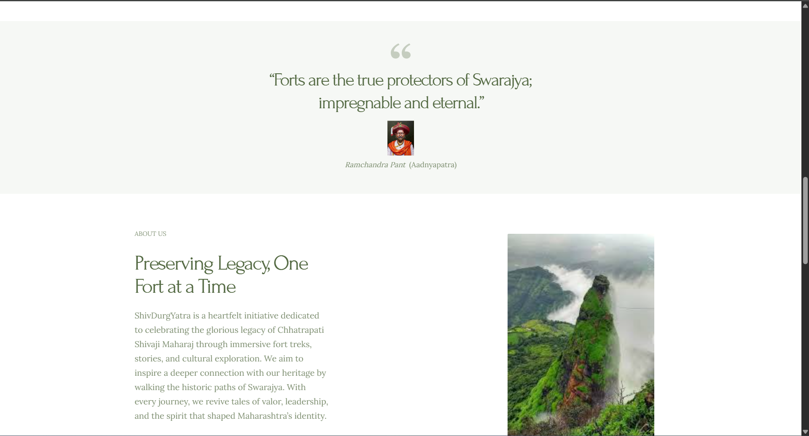

# 🏰 ShivDurgYatra – A WordPress Blog on the Forts of Chhatrapati Shivaji Maharaj

**ShivDurgYatra** is a WordPress-powered blog site dedicated to showcasing the historic forts built and ruled by Chhatrapati Shivaji Maharaj. This site was developed locally using WordPress and enhanced with powerful tools like the **Astra plugin**, **Love Nature theme**, and **Elementor page builder** for a rich and visually engaging experience.

---

## 🌟 Project Highlights

- 📝 **Dynamic Blog**: Features detailed write-ups on major forts like Raigad, Pratapgad, Sinhagad, and more.
- 🎨 **Custom Design**: Designed using the *Love Nature* theme, styled and structured with **Elementor**.
- 🚀 **Astra Plugin**: Integrated for speed optimization and layout enhancements.
- 🗂️ **Easy Navigation**: Clean layout with categories, recent posts, and image-rich content.

---

## 🔧 Tech Stack & Tools Used

- **WordPress** (from wordpress.org)
- **XAMPP** (Local server with Apache & MySQL)
- **PHP, MySQL**
- **Elementor** (Page Builder)
- **Love Nature** (Theme)
- **Astra Plugin** (Performance & layout)
- **Custom CSS** for additional styling

---

## 📸 Screenshots

| Home Page 1 | Home Page 1 | Home Page 1 | Home Page 1 |
|----------|------------|------------------|
|  |  |  |  |

---

## 🚀 How to View Locally

1. **Install [XAMPP](https://www.apachefriends.org/index.html)**
2. Place this project folder into the `/htdocs` directory.
3. Start Apache and MySQL via XAMPP Control Panel.
4. Open your browser and run the site.

---

## 📚 Learning Objectives / What I Did

- Learned how to set up and configure a WordPress site from scratch.
- Customized the look and feel using Elementor and Love Nature.
- Worked with plugins like Astra to enhance user experience and site performance.
- Gained hands-on experience with local development using XAMPP and WordPress.

---

## 📌 About the Author

**Purva Sanjay Jadhav**  
Passionate about history, web development, and blending technology with heritage storytelling.

---

> ⚠️ *Note: This project is currently hosted locally and not deployed on the web. Screenshots and code structure are shared to showcase my work.*

